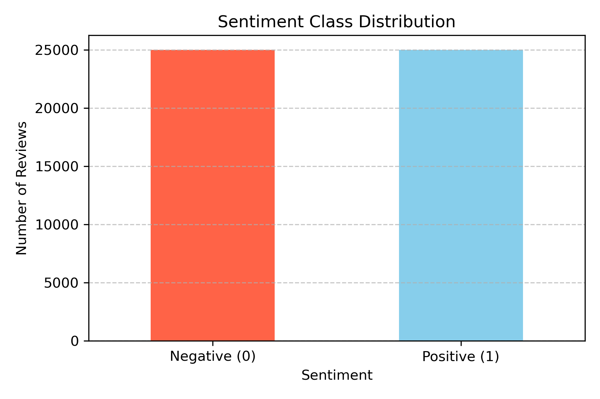
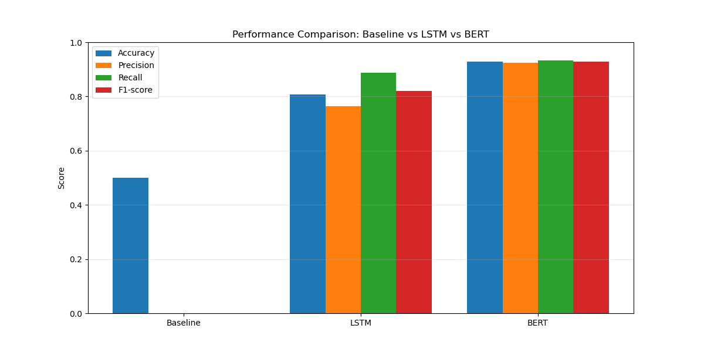
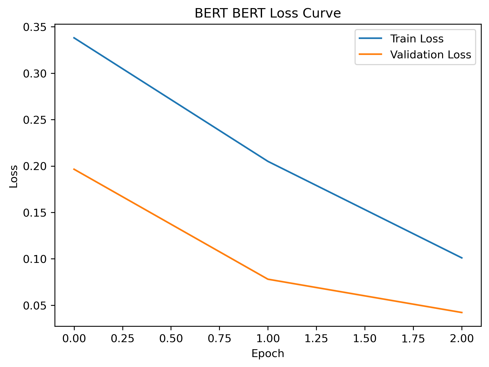
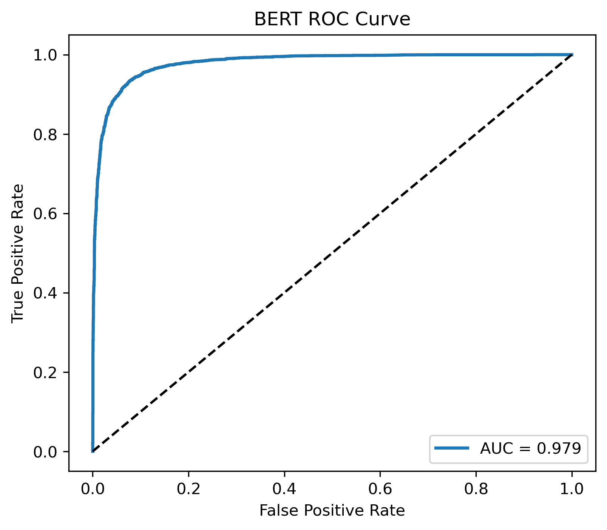
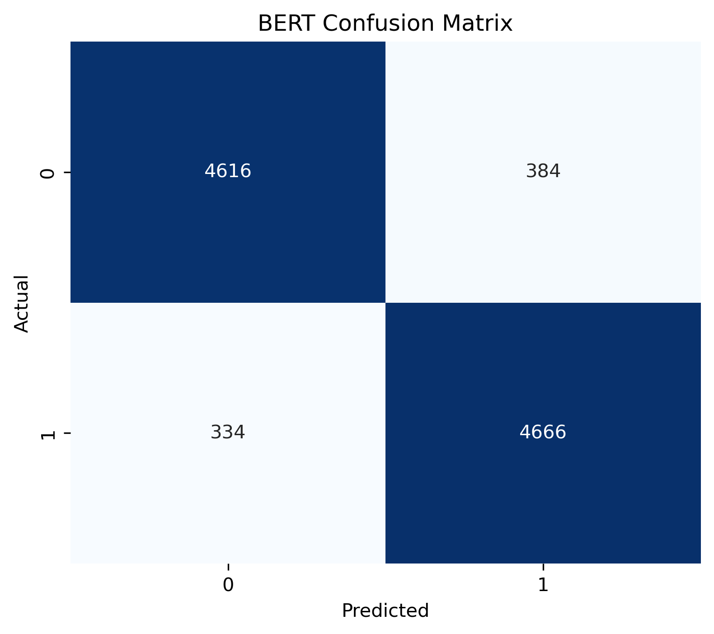

# 🎬 IMDb Sentiment Analysis with ML, LSTM & BERT

This project performs sentiment classification of IMDb movie reviews using multiple approaches — including traditional Machine Learning models, a Deep Learning LSTM model, and a modern Transformer-based BERT model. The purpose is to compare performance across different techniques and evaluate trade-offs between accuracy, complexity, and training cost.

---

## 🚀 Project Highlights
- 📊 Dataset: 50,000 labeled IMDb movie reviews (binary sentiment)
- 🧠 Models implemented:
  - Logistic Regression, SVM, RandomForest
  - LSTM (Deep Learning)
  - BERT (Transformer model)
- 🏆 Best Model Performance: **BERT – Accuracy 92%**
- 🔍 Evaluation metrics: Accuracy, Precision, Recall, F1-score, Confusion Matrix, ROC Curve
- 🎯 Use Case: Customer sentiment analysis for reviews on platforms like Amazon, IMDb, TripAdvisor

---

## 📂 Repository Structure

- ├── src/
- │   ├── data_loader.py        ------# Load IMDb dataset
- │   ├── preprocessing.py      ------# Text cleaning, tokenization, TF-IDF, LSTM/BERT prep
- │   ├── train_ml.py           ------# Train TF-IDF + NB + SVM
- │   ├── train_lstm.py         ------# Train LSTM model
- │   ├── train_bert.py         ------# Train BERT model
- │   ├── evaluate.py           ------# Metrics, confusion matrix, ROC curve
- │   ├── utils.py              ------# Helper functions
- │   └── main.py               ------# Main pipeline runner
- │
- ├── notebooks/
- │   └── Applied AI Harshaa Hariharan.ipynb
- │
- ├── models/                   ------# Saved ML, LSTM, BERT models
- ├── Visuals/                  ------# Plots generated during evaluation
- ├── requirements.txt
- └── README.md

---

## 📈 Model Performance Comparison
🔹 Classical Machine Learning Models
|Model |	Accuracy | 	Precision	| Recall	| F1-score|
|--------|---------|---------|--------|----------|
|Naïve Bayes| 0.8647	| 0.8529	| 0.8814	| 0.8670 |
|Linear SVM	| 0.8906	| 0.8867	| 0.8956	| 0.8911 |

🔹 Deep Learning Models
|Model |	Accuracy | 	Precision	| Recall	| F1-score|
|--------|---------|---------|--------|----------|
| LSTM | 0.8071 | 0.7647 | 0.8872 | 0.8214 | 0.9000 |
| **BERT** | **0.9282** | **0.9240** | **0.9332** | **0.9286** | **0.9789** |

---

## 🧪 Tech Stack
- Python, NumPy, Pandas, Scikit-learn
- TensorFlow / Keras
- Transformers (BERT)
- Matplotlib / Seaborn / Plotly

---

## 🛠️ Future Enhancements
- Add Streamlit inference web application
- Hyperparameter tuning & dropout optimization
- MLflow experiment tracking

---
## 📝 Summary of Findings

- 🚀 BERT is the strongest performer, outperforming LSTM and classical ML models.
- 🔥 Linear SVM performs surprisingly well given its simplicity, scoring ~0.89 accuracy.
- 📉 LSTM performance is good but suffers compared to BERT due to lack of context-awareness.
- ⚡ Classical ML is fast and efficient; BERT is computationally expensive but most accurate.

---

## 🙋‍♀️ Author
**Harshaa Hariharan**  
Machine Learning & Data Science  
LinkedIn: *www.linkedin.com/in/harshaa-harshini-64522530hbc329*  
Portfolio Website: *(coming soon)*

---

## 📊 Model Evaluation

### Sentiment Class Distribution


### Performance Comparison


### BERT Loss Curve


### BERT ROC Curve


### BERT Confusion Matrix


---

## 🚀 How to Run the Project

### 1. Clone the repository
```bash
git clone https://github.com/Harshaa329/imdb-sentiment-analysis-bert-lstm.git
cd imdb-sentiment-analysis-bert-lstm
```
### 2. Install dependencies
```bash
pip install -r requirements.txt
```
### 3. Run Jupyter Notebook
```bash
jupyter notebook
```
notebooks/Applied AI Harshaa Hariharan.ipynb

---

## ⭐ Conclusion
BERT outperforms both LSTM and classical ML models, achieving the highest accuracy and F1-score.  
This demonstrates the power of Transformer models in sentiment analysis tasks.

